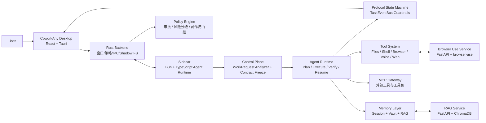
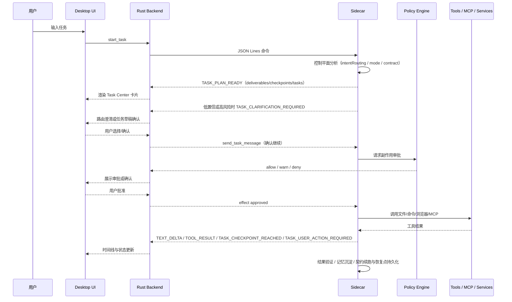
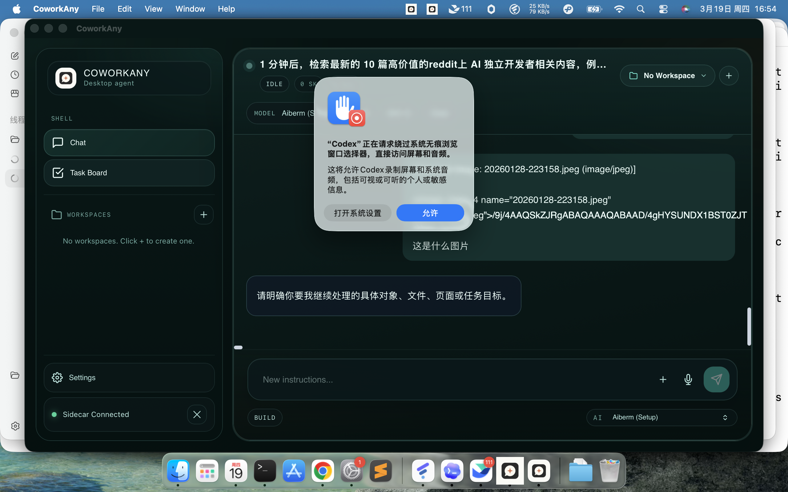
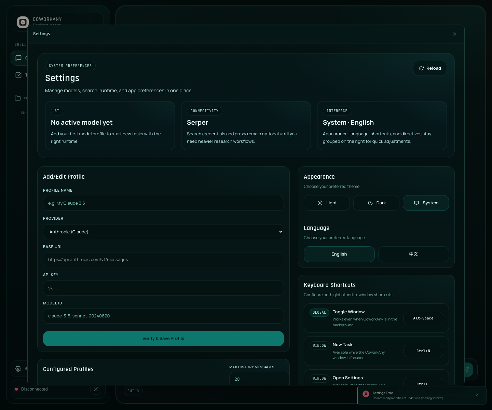
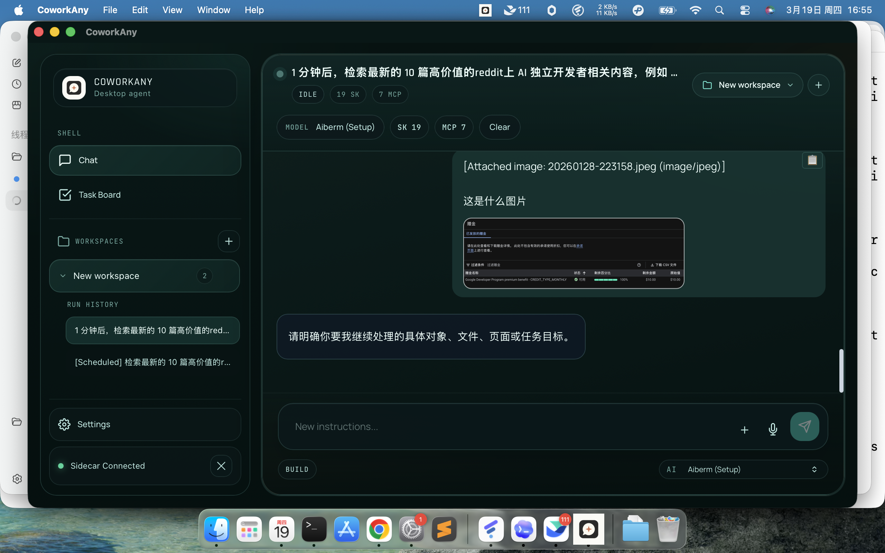
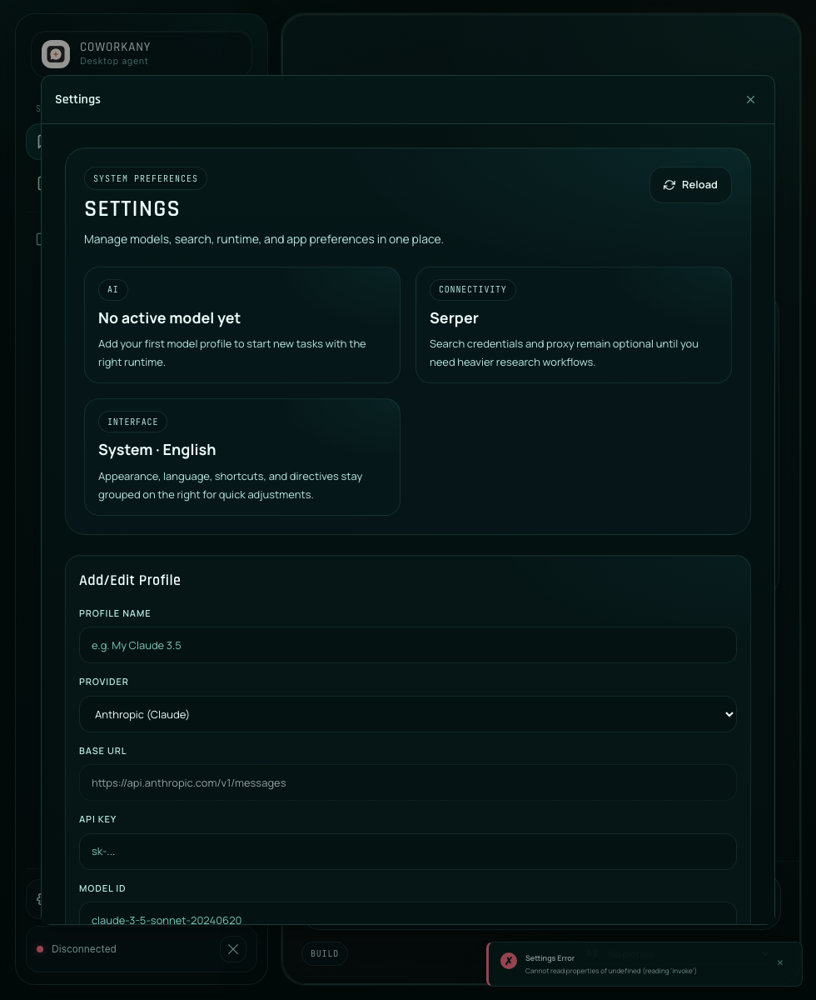

# CoworkAny

[](https://github.com/GiantClam/coworkany)


> 与 AI 协作完成任何任务的桌面工作台。
>
> CoworkAny 把桌面应用、代理执行引擎、记忆系统、浏览器自动化、技能系统和安全审批放进一个完整闭环里，让 AI 不只是“回答问题”，而是真正参与执行、验证、恢复和持续协作。
>
> README 已对齐 2026-03 最新技术方案：统一任务控制平面、任务中心卡片、路由澄清与任务草稿确认、协议状态机加固。

## 快速导航

- [为什么是 CoworkAny](#为什么是-coworkany)
- [最新技术方案（2026-03）](#最新技术方案2026-03)
- [系统架构总览](#系统架构总览)
- [界面预览](#界面预览)
- [使用说明](#使用说明)
- [相比 OpenClaw / Nanobot 的优势](#coworkany-相比-openclaw--nanobot-的优势)
- [开发命令](#开发命令)
- [贡献与社区](#贡献与社区)
- [文档导航](#文档导航)

## 为什么是 CoworkAny

大多数 AI Agent 项目只解决其中一部分问题：有的擅长 CLI 执行，有的擅长工具编排，有的擅长工作空间限制，但缺少桌面端交互、安全审批、跨会话记忆、任务恢复和可视化协作。

CoworkAny 的目标不是做一个单点能力的 Agent，而是把下面这些能力收敛到一个统一产品里：

- `桌面交互`: Tauri 桌面壳 + React UI，适合日常持续使用，而不只是一次性命令行运行
- `可控执行`: 所有副作用通过策略层和审批路径治理，而不是完全相信模型“自觉收手”
- `多引擎协作`: Desktop、Sidecar、RAG、Browser Use Service 分层解耦
- `长期协作`: 会话记忆、知识沉淀、自学习技能、任务恢复
- `面向真实工作`: 编程、浏览器自动化、工作区操作、个人效率任务共用一个交互入口

## 核心能力

| 能力域 | 说明 | 典型场景 |
| --- | --- | --- |
| 桌面 AI 协作 | 多任务聊天、任务时间线、设置与工作区管理 | 日常问答、任务追踪、上下文切换 |
| 编程辅助 | 文件读写、命令执行、代码质量检查、验证流程 | 修 Bug、实现功能、跑测试、审查 diff |
| 浏览器自动化 | Playwright 桥接 + Python browser-use service | 打开站点、抓取内容、表单操作、社媒流程 |
| 任务控制平面 | `analyze_work_request` 归一化请求、冻结执行契约、统一 `chat / immediate / scheduled` 路由 | 降低意图误判、稳定调度任务、减少临场追问 |
| 任务协作卡片 | 任务图聚合、检查点、用户动作请求、Task Center 时间线展示 | 长流程任务跟踪、并行/串行任务可视化、中断续跑 |
| 记忆系统 | Markdown Vault + RAG 索引 + 会话恢复 | 长期偏好记忆、项目知识检索、跨会话连续工作 |
| 技能与 MCP | 本地 Skills、GitHub 安装、MCP Gateway | 扩展私有工具链、复用标准流程 |
| 安全治理 | Effect-gated execution、审批、Shadow FS、协议状态机守卫 | 文件写入、Shell 执行、网络访问前置把关，阻断非法生命周期跃迁 |

## 最新技术方案（2026-03）

最近一轮方案与实现重点集中在“任务中心化”，核心变化如下：

1. **统一控制平面（Control Plane）**
   - 所有请求先归一化为结构化 `WorkRequest`，再进入执行层。
   - 内部统一覆盖 `chat`、`immediate_task`、`scheduled_task`、`scheduled_multi_task`。
2. **Agent-Led 执行契约**
   - 任务执行前冻结 `deliverables / checkpoints / userActionsRequired / defaultingPolicy / resumeStrategy`。
   - 运行时按契约执行、恢复与复盘，而不是仅依赖自由文本提示。
3. **任务路由澄清与草稿确认**
   - 支持 `/ask`、`/task`、`/schedule` 显式触发。
   - 低置信度请求触发“回答 vs 任务”澄清；高风险或调度类任务先生成草稿再确认。
4. **任务中心卡片（Task Center Card）**
   - Timeline 将任务生命周期聚合为单一 `task_card`，并展示单任务/串行/并行/DAG 结构。
   - 协作动作（确认、补充、继续）统一通过任务消息链路回流。
5. **协议状态机加固**
   - 在 `TaskEventBus` 构建事件时统一校验生命周期合法性。
   - 保证 `completed` 与阻塞类 `user_action_required` 不冲突，异常转写为显式失败事件。

## 系统架构总览



### 架构特征摘要

- `桌面宿主化`: 不是浏览器页面包一层壳，而是让 Tauri/Rust 直接承担进程、策略、系统桥接职责
- `控制平面前置`: 先把自然语言请求收敛成结构化任务契约，再交给执行层
- `执行与展示分离`: UI 不直接做智能决策，Sidecar 也不直接控制用户体验
- `服务按能力拆分`: 记忆检索和浏览器智能操作通过独立 Python 服务承接
- `审批与协议双重守卫`: 审批负责副作用治理，协议状态机负责生命周期一致性

### 分层职责

#### 1. Desktop

- 提供主交互界面、任务列表、聊天时间线、设置、工作区和技能管理
- 使用 Tauri 将前端与本地系统能力连接起来
- 承担用户可见的审批与确认体验

#### 2. Rust Backend

- 管理 Sidecar 生命周期与 JSON Lines IPC
- 负责策略执行、Shadow FS、窗口管理、进程管理
- 统一托管 Sidecar 与 Python 服务

#### 3. Sidecar

- 是真正的 Agent Runtime
- 包含控制平面（WorkRequest 分析与契约冻结）+ 执行平面（工具调用、恢复、验证）
- 负责任务拆解、LLM 路由、技能装载、MCP 注册、记忆调用与恢复
- 把 stdout 严格保留给 IPC，日志输出到 stderr 与轮转日志

#### 4. Python Services

- `rag-service`: 为长期知识和记忆检索提供语义搜索能力
- `browser-use-service`: 为复杂网页操作提供更高层的浏览器自动化能力

## 一次任务是怎么跑起来的



## 界面预览

| 主界面 | 设置页 |
| --- | --- |
|  |  |

| 首次启动/新环境 | 窄屏设置视图 |
| --- | --- |
|  |  |

> 以上截图来自仓库内已有 Playwright 输出产物，可直接在 GitHub 首页渲染。

## 仓库结构

```text
coworkany/
├── desktop/                  # Tauri 桌面应用
│   ├── src/                  # React 前端
│   ├── src-tauri/            # Rust 后端与进程/策略桥接
│   └── tests/                # UI、E2E、桌面侧验证
├── sidecar/                  # Bun/TypeScript Agent Runtime
│   ├── src/orchestration/    # 控制平面：意图分析、任务契约、执行计划
│   ├── src/execution/        # 执行平面：运行时、恢复、状态机、事件总线
│   ├── src/protocol/         # 任务事件协议与数据契约
│   ├── src/tools/            # 内置工具与工具注册
│   ├── src/agent/            # Agent 推理、学习、验证、推荐
│   ├── src/mcp/              # MCP Gateway
│   ├── src/evals/            # 控制平面评测与回放
│   └── tests/                # Sidecar 测试
├── rag-service/              # Python FastAPI + ChromaDB
├── browser-use-service/      # Python FastAPI 浏览器自动化服务
├── docs/                     # 技术设计、用户文档、发布文档
└── .coworkany/               # 本地状态、技能、日志、vault
```

## 使用说明

### 环境要求

- `Node.js >= 22.22.1 < 23`
- `Bun >= 1.2.0`
- `Rust` 与 Tauri 开发环境
- `Python 3.x`

### 1. 安装依赖

```bash
cd desktop
npm install

cd ../sidecar
bun install
```

### 2. 配置模型

创建 [sidecar/llm-config.json](sidecar/llm-config.json)：

```json
{
  "provider": "anthropic",
  "anthropic": {
    "apiKey": "sk-ant-...",
    "model": "claude-sonnet-4-5"
  }
}
```

可选环境变量可参考 [.env.example](.env.example)，用于天气、新闻、Google Calendar / Gmail 等能力。

### 3. 启动桌面应用

```bash
cd desktop
npm run tauri dev
```

当前桌面端开发流程由 [desktop/src-tauri/tauri.conf.json](desktop/src-tauri/tauri.conf.json) 驱动：

- `beforeDevCommand`: `npm run dev:tauri-server`
- `devUrl`: `http://localhost:5173`
- 打包时会同时带上 `sidecar`、`rag-service`、`browser-use-service`

### 4. 单独启动服务

如果你想独立调试服务，也可以分别启动：

```bash
cd sidecar
bun run src/main.ts
```

```bash
cd rag-service
python main.py
```

```bash
cd browser-use-service
python main.py
```

### 5. 首次使用建议路径

1. 打开应用后先配置模型 Provider 和 API Key
2. 创建或选择一个工作空间
3. 从聊天界面发起任务（可直接自然语言，或用 `/ask`、`/task`、`/schedule`）
4. 若触发路由澄清或任务草稿，先在 Task Card 中确认路径
5. 当涉及文件写入、Shell、网络等副作用时，按提示审批
6. 在时间线 Task Center 卡片中观察计划、检查点、用户动作请求与恢复状态

## 典型使用方式

### 编程协作

```text
帮我分析这个仓库的架构，并找出 sidecar 的任务恢复入口
```

```text
修复 desktop 中断任务恢复的 UI 状态不同步问题，然后补一条测试
```

```text
/task 把 docs/TECHNICAL_DESIGN.md 的关键点整理成 docs/architecture-summary.md
```

### 浏览器自动化

```text
打开目标网站，抓取页面正文并整理成要点
```

```text
登录后进入后台，帮我检查表单提交流程里有没有明显报错
```

```text
/schedule 明天早上 9 点抓取目标站点首页并输出 reports/daily-site-brief.md
```

### 个人效率与知识管理

```text
总结今天的重要邮件和日程安排
```

```text
把这次排障过程沉淀成一条可复用技能
```

## 适合放到 GitHub 首页的价值主张

如果用一句话概括 CoworkAny：

> 它不是“一个会调用工具的模型”，而是“一个带桌面交互、安全治理、长期记忆和多服务编排能力的本地 AI 工作台”。

这意味着它更适合展示给下面两类人：

- 想找一个完整 Agent Product 参考实现的人
- 想看桌面 AI、执行安全、任务恢复、MCP/Skills 如何组合成产品闭环的人

## CoworkAny 相比 OpenClaw / Nanobot 的优势

下面的对比不是“跑分”结论，而是基于本仓库当前设计与实现方向做的产品形态对比，重点看整体协作闭环。

| 维度 | CoworkAny | OpenClaw | Nanobot |
| --- | --- | --- | --- |
| 产品形态 | `桌面应用 + 本地 Agent Runtime + 服务编排` | 更偏 `Agent / 技能 / 执行框架` | 更偏 `受限工作区中的本地 Agent/自动化` |
| 主要交互 | 图形界面、任务时间线、设置、审批、工作区 | 以 Agent 机制和执行模型为核心 | 以本地执行和工作区限制为核心 |
| 安全执行 | `Policy Engine + Effect 审批 + Shadow FS + UI 确认` | 强调审批、least privilege、执行治理 | 强调 host/workspace 边界与限制 |
| 本地长期使用体验 | `强`，适合持续桌面协作 | 通常更偏“执行引擎”视角 | 通常更偏“本地代理”视角 |
| 任务恢复 | `内建中断恢复、状态持久化、UI 可见` | 依赖具体运行框架设计 | 依赖宿主配置与运行约束 |
| 技能体系 | `本地 Skills + GitHub 安装 + OpenClaw 兼容层` | Skills 概念成熟 | 以工作区/宿主限制与执行为主 |
| 外部工具扩展 | `MCP Gateway + 内置工具 + Python 服务` | 取决于框架集成 | 取决于宿主工具模型 |
| 浏览器能力 | `Playwright Bridge + browser-use-service` | 一般需要额外集成 | 一般需要额外集成 |
| 记忆系统 | `Session Memory + Vault + RAG Service` | 取决于上层产品是否实现 | 通常不是核心卖点 |

### 更直白地说，CoworkAny 的优势在这里

#### 1. 它不是单纯的 Agent Runtime，而是完整桌面产品

如果你想要的是“能长期挂在桌面上使用”的 AI 协作环境，而不是一次次从命令行重新进入上下文，CoworkAny 的方向更完整。

#### 2. 它把执行能力和用户可见的审批体验接起来了

很多系统在安全上是对的，但用户体验上是隐形的。CoworkAny 通过桌面端把审批、确认、时间线、恢复、状态可视化整合在一起，更适合真实日常使用。

#### 3. 它把多类任务收进同一个工作台

代码、浏览器、工作区、记忆、技能、MCP，不再是几个分散脚本或独立工具，而是统一走一套任务生命周期。

#### 4. 它天然适合扩展成“持续协作者”

因为它已经有：

- 会话记忆
- 长期知识 Vault
- 自学习技能沉淀
- Sidecar 中断恢复
- 可独立编排的 Python 服务

这比只提供“执行一次任务”的 Agent，更接近长期搭档。

## 关键设计亮点

<details>
<summary><strong>1. Effect-Gated Execution</strong></summary>

所有高风险副作用都应经过治理路径，而不是直接放给模型执行：

- 文件写入
- Shell 执行
- 网络访问
- 浏览器操作
- 代码执行

这样可以把“模型会不会乱来”变成“系统是否允许它继续”。

</details>

<details>
<summary><strong>2. Desktop + Sidecar 解耦</strong></summary>

前端 UI、Rust 宿主、Agent Runtime 分层清晰：

- UI 负责展示与交互
- Rust 负责系统桥接与策略
- Sidecar 负责智能与执行编排

这使得系统更容易演进，也更适合后续替换模型、扩展工具或接入更多服务。

</details>

<details>
<summary><strong>3. OpenClaw Skills 兼容思路</strong></summary>

CoworkAny 并不是另起炉灶做一套完全孤立的技能生态，而是保留了对 OpenClaw 风格 `SKILL.md` 的兼容能力，降低迁移和复用成本。

</details>

<details>
<summary><strong>4. Memory + RAG + Workflow 闭环</strong></summary>

不是只有“我记住了”，而是：

- 会话里记住
- 长期沉淀到 Vault
- 可以语义搜索
- 可以继续转化成技能或流程

</details>

## 开发命令

### 统一测试入口（Codex / CI 推荐）

```bash
npm run test:codex -- --mode pr --subset sidecar
npm run test:codex -- --mode pr --subset desktop
npm run test:codex -- --mode pr --subset desktop-e2e
```

### Desktop

```bash
cd desktop
npm run dev
npm run build
npm run test
npm run test:e2e
```

### Sidecar

```bash
cd sidecar
bun run src/main.ts
npm run typecheck
npm run test:stable
npm run test:all
```

## 贡献与社区

如果你准备把这个仓库作为开源项目参与协作，先看这些文件：

- [CONTRIBUTING.md](CONTRIBUTING.md)
- [CODE_OF_CONDUCT.md](CODE_OF_CONDUCT.md)
- [SECURITY.md](SECURITY.md)
- [LICENSE](LICENSE)

仓库现在也已经带上了：

- Bug / Feature Issue 模板
- Pull Request 模板
- CI、打包、Release GitHub Actions 工作流
- Dependabot 依赖更新配置

## 文档导航

- [技术方案总览](docs/TECHNICAL_DESIGN.md)
- [统一控制平面设计（2026-03-18）](docs/plans/2026-03-18-unified-orchestration-control-plane-design.md)
- [Agent-Led 任务编排（2026-03-20）](docs/plans/2026-03-20-coworkany-agent-led-task-orchestration.md)
- [协议状态机加固（2026-03-22）](docs/plans/2026-03-22-protocol-state-machine-hardening.md)
- [任务中心卡片方案（2026-03-24）](docs/plans/2026-03-24-task-centered-task-card-design.md)
- [聊天/任务触发机制（2026-03-24）](docs/plans/2026-03-24-chat-vs-task-ui-trigger-design.md)
- [中文用户指南](docs/USER_GUIDE_CN.md)
- [发布说明](docs/RELEASING.md)
- [macOS 分发说明](docs/macos-distribution.md)
- [贡献指南](CONTRIBUTING.md)
- [安全策略](SECURITY.md)
- [行为准则](CODE_OF_CONDUCT.md)
- [许可证](LICENSE)

## 适合谁

CoworkAny 更适合下面这些人：

- 想把 AI 作为桌面长期协作工具，而不是一次性问答工具
- 需要同时处理代码、浏览器、文件、知识和个人效率任务
- 希望执行能力强，但又不想牺牲审批、安全和可见性
- 需要跨会话延续上下文，而不是每次都重新解释项目背景

## 当前状态

这是一个正在快速演进的桌面 Agent 项目。仓库里同时包含：

- 主桌面应用
- 本地 Agent Runtime
- Python 辅助服务
- 大量测试与实验性能力

如果你是首次进入仓库，建议优先阅读：

1. [README.md](README.md)
2. [docs/TECHNICAL_DESIGN.md](docs/TECHNICAL_DESIGN.md)
3. [docs/USER_GUIDE_CN.md](docs/USER_GUIDE_CN.md)

---

**CoworkAny = Desktop Product + Governed Agent Runtime + Memory + Browser Automation + Extensible Skills/MCP**
