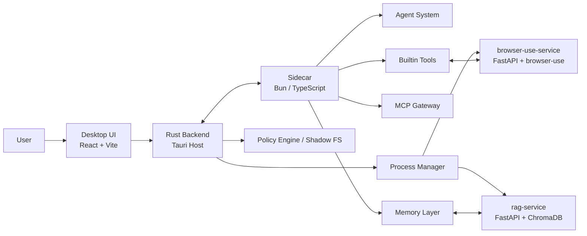
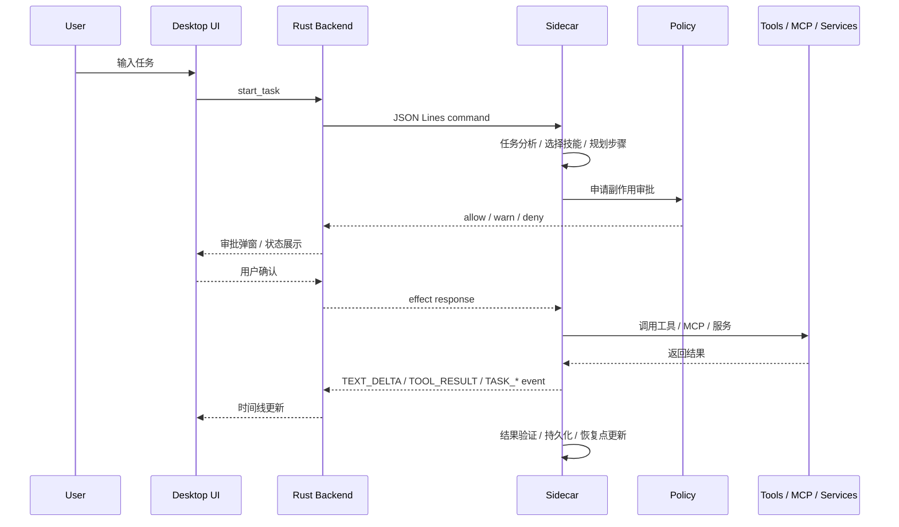

# CoworkAny 技术设计

> 更新日期：2026-03-20
>
> 本文档描述 CoworkAny 当前仓库形态下的系统结构、运行路径、核心子系统、数据边界与开发方式。它面向贡献者、架构评审和新加入项目的开发者，重点回答三个问题：
>
> 1. 这个系统由哪些进程和模块组成？
> 2. 一次任务是如何被接收、审批、执行、验证并持久化的？
> 3. 为什么它被设计成 Desktop + Sidecar + Services 的分层结构？

## 1. 产品定位

CoworkAny 是一个面向本地持续协作场景的桌面 AI 工作台，而不是单次运行的命令行 Agent。

它的目标是把下列能力放进同一个产品闭环：

- 图形界面交互
- 本地任务执行
- 安全审批与副作用治理
- 浏览器自动化
- 长短期记忆
- 技能与 MCP 扩展
- 中断恢复与持续协作

这意味着 CoworkAny 的设计重点不是“模型会不会调用工具”，而是“一个本地 AI 执行系统如何长期、可控、可恢复地参与真实工作”。

## 2. 设计原则

### 2.1 Desktop-first

用户不是通过一次性 CLI 会话使用系统，而是通过桌面应用持续工作。因此：

- 状态必须可见
- 审批必须可交互
- 任务必须可追踪
- 中断必须可恢复

### 2.2 Policy over prompt

高风险操作不依赖模型“自律”，而依赖运行时策略层：

- 文件写入
- Shell 执行
- 网络访问
- 代码执行
- 浏览器自动化

模型可以提出行动，但系统必须有能力决定是否放行。

### 2.3 分层解耦

系统被拆成 Desktop、Rust Backend、Sidecar、Python Services 四层，不让 UI、系统桥接、Agent 智能、专用服务相互缠绕。

### 2.4 长期协作优先

CoworkAny 不是一次任务执行器，因此需要：

- 会话级上下文
- 长期知识沉淀
- 任务恢复点
- 可复用技能

## 3. 总体架构



### 3.1 为什么是这四层

#### Desktop UI

负责：

- 聊天交互
- 时间线展示
- 设置、技能、MCP、工作区管理
- 审批确认

不负责：

- 智能决策
- 复杂业务编排
- 底层系统权限控制

#### Rust Backend

负责：

- 宿主级能力与系统桥接
- Sidecar 生命周期管理
- 策略执行与副作用治理
- Shadow FS、窗口管理、系统资源调用
- Python 服务托管

不负责：

- 任务推理
- LLM 决策
- 工具语义编排

#### Sidecar

负责：

- Agent 推理与任务编排
- 工具选择与执行
- LLM Provider 路由
- 技能加载
- MCP 工具注册
- 记忆访问、任务恢复、验证

不负责：

- 直接控制 UI
- 直接绕过策略层写入高风险副作用

#### Python Services

负责承接专门能力：

- `rag-service`: 语义索引与检索
- `browser-use-service`: 更高层的浏览器智能操作

这样做的价值是把重依赖、专领域逻辑从主 Agent Runtime 中拆出去。

## 4. 运行时拓扑

### 4.1 主要进程

| 进程 | 技术栈 | 主要职责 |
| --- | --- | --- |
| Desktop App | Tauri 2 + Rust + React 18 | UI、系统桥接、策略执行、Sidecar 宿主 |
| Sidecar | Bun + TypeScript | Agent Runtime、工具系统、MCP、记忆、执行编排 |
| rag-service | Python + FastAPI + ChromaDB | Markdown Vault 的索引与语义搜索 |
| browser-use-service | Python + FastAPI + browser-use | 复杂网页智能操作 |

### 4.2 实际仓库入口

| 模块 | 入口文件 |
| --- | --- |
| Desktop 前端 | `desktop/src/main.tsx` |
| Desktop Rust | `desktop/src-tauri/src/main.rs` |
| Sidecar | `sidecar/src/main.ts` |
| RAG Service | `rag-service/main.py` |
| Browser Use Service | `browser-use-service/main.py` |

### 4.3 关键桥接模块

| 文件 | 职责 |
| --- | --- |
| `desktop/src-tauri/src/sidecar.rs` | Sidecar 启动、stdin/stdout IPC、事件转发 |
| `desktop/src-tauri/src/process_manager.rs` | Sidecar / Python 服务统一托管 |
| `desktop/src-tauri/src/shadow_fs.rs` | 影子文件系统与 diff 支持 |
| `desktop/src-tauri/src/ipc.rs` | Tauri 侧 IPC 命令与桥接 |
| `sidecar/src/main.ts` | Sidecar 入口，命令路由与运行时初始化 |

## 5. 任务生命周期

一次任务从输入到结束，通常经过以下阶段：



### 5.1 输入阶段

Desktop 将用户消息和上下文打包为 IPC 命令发送给 Sidecar。典型命令包括：

- `start_task`
- `send_task_message`
- `cancel_task`
- `resume_interrupted_task`

### 5.2 规划阶段

Sidecar 根据任务内容做几件事：

- 识别任务意图
- 选择可用工具和技能
- 决定是否需要访问记忆或 MCP
- 创建执行路径和恢复点

### 5.3 执行阶段

Sidecar 调用内置工具、MCP 工具或 Python 服务完成动作。

所有高风险动作都不应直接越过策略层。

### 5.4 验证阶段

任务执行后，运行时可继续做：

- 结果验证
- 错误重试
- 工具链后置检查
- 记忆沉淀

### 5.5 恢复阶段

当任务被中断、Sidecar 重启或桌面应用重启时，系统尝试：

- 恢复任务运行时记录
- 重建任务状态
- 提示用户继续执行

这也是 CoworkAny 与很多一次性 Agent Demo 的关键差异之一。

## 6. 核心子系统

### 6.1 Agent System

Agent System 位于 Sidecar 内部，是系统的决策中心。

主要职责：

- 任务理解
- 分步推理
- 工具调用
- 错误处理
- 自学习与复用
- 结果验证

当前从目录上可以看到的核心域包括：

- `sidecar/src/agent/`
- `sidecar/src/execution/`
- `sidecar/src/orchestration/`
- `sidecar/src/scheduling/`
- `sidecar/src/memory/`

### 6.2 Tool System

Tool System 负责把“可执行能力”以统一接口暴露给 Agent。

能力大致分为：

- 文件工具
- Shell / 代码执行工具
- 浏览器工具
- Web 搜索与网络工具
- 记忆工具
- 个人效率工具
- 语音能力

内置工具定义可从 `sidecar/src/tools/` 目录理解，标准工具结构体和 effect 类型定义在 `sidecar/src/tools/standard.ts`。

### 6.3 Skills

Skills 是可复用指令包，适合放置：

- 某类任务的流程约束
- 特定项目规范
- 工具组合使用规则
- 高层执行策略

CoworkAny 支持：

- 本地技能
- GitHub 安装技能
- 自学习沉淀技能
- OpenClaw 风格 `SKILL.md` 兼容

### 6.4 MCP Gateway

MCP Gateway 让外部工具和服务可以统一接入 Agent Runtime。

它负责：

- Server 生命周期管理
- 工具发现
- 注册到工具注册表
- 与策略层协同

MCP 的存在使系统不必把所有能力都硬编码在 Sidecar 内部。

### 6.5 Memory Layer

记忆系统大致分成三类：

| 层级 | 作用 | 形态 |
| --- | --- | --- |
| 会话记忆 | 当前或最近会话上下文 | JSON / 运行时状态 |
| 长期记忆 | 用户偏好、项目知识、长期经验 | Markdown Vault |
| 语义检索层 | 从长期知识中按语义召回 | RAG Service |

这套组合的重点不是“保存聊天记录”，而是让系统具备真正的跨会话连续性。

### 6.6 Security Model

CoworkAny 的安全设计重点是 `Effect-Gated Execution`。

常见 effect 可以抽象为：

- `filesystem:read`
- `filesystem:write`
- `filesystem:delete`
- `network:outbound`
- `process:spawn`
- `code:execute`
- `state:remember`

对于高风险动作，系统会走审批与策略路径，而不是让 Agent 直接执行。

### 6.7 Shadow FS

影子文件系统的目标是把“文件修改”从立即落盘变成“可审查的变更候选”。

价值在于：

- 降低误写风险
- 提供 diff 审查基础
- 与审批机制结合
- 让用户在桌面端看见即将发生的修改

### 6.8 Process Manager

Rust 侧进程管理负责：

- 启动 Sidecar
- 启动 Python 服务
- 执行健康检查
- 在异常时重启
- 统一日志与资源路径

这一层让桌面端成为真正的宿主，而不是简单前端壳。

## 7. 前端架构

前端位于 `desktop/src/`，核心职责不是做业务逻辑，而是把运行时状态可视化出来。

### 7.1 主要界面域

根据当前目录结构，前端主要包含：

- `components/Chat/`
- `components/Settings/`
- `components/Sidebar/`
- `components/Skills/`
- `components/Mcp/`
- `components/Workspace/`
- `components/Setup/`
- `components/jarvis/`

### 7.2 前端职责

- 展示任务时间线
- 展示工具调用和事件
- 展示审批/确认
- 管理工作区、技能、MCP、设置
- 触发任务启动、取消、恢复

### 7.3 为什么前端不持有主导权

如果把任务逻辑放在前端：

- 状态难以恢复
- 安全治理会变弱
- 服务编排会变得混乱
- 多运行时协作会更难维护

因此 CoworkAny 把前端保持在“交互层”和“状态展示层”。

## 8. 数据与持久化

系统中有多类持久化数据：

| 数据类型 | 典型位置 | 说明 |
| --- | --- | --- |
| 本地状态 | `.coworkany/` | 日志、技能、工作区状态、运行时数据 |
| 会话与任务状态 | 项目内或应用状态目录 | 用于恢复与连续协作 |
| 长期知识 | `~/.coworkany/vault/` | Markdown 知识库 |
| 语义索引 | ChromaDB 路径 | RAG 检索数据 |
| 配置 | `sidecar/llm-config.json` 等 | 模型、代理、工作区、工具相关配置 |

### 8.1 为什么需要多种存储

因为这些数据生命周期不同：

- 有的是会话级
- 有的是系统级
- 有的是跨项目共享
- 有的是只服务于索引与检索

把它们混成一份单体状态文件会很难治理。

## 9. 技术栈

### 9.1 当前主要技术

| 层级 | 技术 |
| --- | --- |
| Desktop Host | Tauri 2 / Rust |
| Frontend | React 18 / TypeScript / Vite 6 |
| UI | Radix UI / CSS Modules / Tailwind 4 |
| Runtime | Bun / Node 兼容生态 |
| Agent & LLM | TypeScript Agent Runtime + 多 Provider |
| Browser Automation | Playwright + browser-use-service |
| Memory / RAG | FastAPI + ChromaDB |

### 9.2 为什么不是单语言单进程

因为系统需求本身横跨：

- 桌面宿主能力
- Web UI
- Agent 编排
- Python 生态专长能力

追求“单技术栈纯洁性”反而会牺牲产品闭环。

## 10. 开发方式

### 10.1 仓库形态

这个仓库不是一个有统一根任务编排的标准 monorepo。

它更像是几个协同演进的兄弟项目：

- `desktop`
- `sidecar`
- `rag-service`
- `browser-use-service`

根目录没有统一 `package.json`，所以开发时通常进入子项目执行命令。

### 10.2 常用开发命令

```bash
cd desktop
npm install
npm run tauri dev
```

```bash
cd sidecar
bun install
bun run src/main.ts
```

```bash
cd rag-service
python main.py
```

```bash
cd browser-use-service
python main.py
```

### 10.3 打包路径

桌面端打包配置定义在 `desktop/src-tauri/tauri.conf.json` 中：

- 开发时启动本地前端服务
- 构建时打包桌面前端
- 同时把 `sidecar`、`rag-service`、`browser-use-service` 带入桌面应用资源目录

## 11. 与其他 Agent 框架的架构差异

从架构视角看，CoworkAny 的差异主要在下面几点：

### 11.1 相对 OpenClaw

- CoworkAny 更强调桌面产品形态，而不只是 Agent 执行框架
- CoworkAny 把审批体验和 GUI 交互做成系统一部分
- CoworkAny 兼容 OpenClaw 风格 Skills，但不依赖单一技能生态作为产品全部核心

### 11.2 相对 Nanobot

- CoworkAny 更强调“长期协作工作台”，不只是“受限本地执行”
- CoworkAny 内建记忆、任务恢复、图形化工作流展示
- CoworkAny 同时吸收工作区边界与 least-privilege 思路，但落到桌面产品与策略宿主中

## 12. 当前限制与演进方向

### 12.1 当前限制

- 仓库中仍存在较多实验性能力与本地产物
- 文档体系还在收拢
- 不同子项目的工具链并不完全统一
- 某些能力仍有“设计已明确、产品细节持续打磨”的状态

### 12.2 演进方向

- 更稳定的审批与策略表达
- 更强的任务恢复与连续执行体验
- 更清晰的工作区 / 本地目录访问治理
- 更成熟的技能与 MCP 市场化能力
- 更完整的桌面产品体验

## 13. 阅读建议

如果你第一次接触这个项目，建议按下面顺序阅读：

1. [README.md](../README.md)
2. [USER_GUIDE_CN.md](./USER_GUIDE_CN.md)
3. [tool-system.md](./tool-system.md)
4. [security-model.md](./security-model.md)
5. [agent-system.md](./agent-system.md)

---

如果只用一句话总结：

**CoworkAny 的本质，是一个以桌面宿主为核心、以 Sidecar 为执行引擎、以策略层为安全边界、以记忆与服务编排为长期能力的本地 AI 协作系统。**
