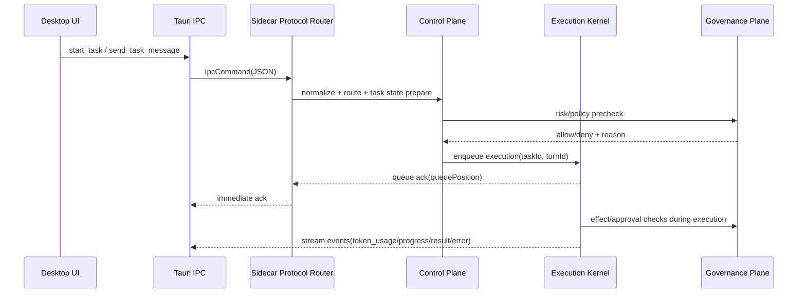
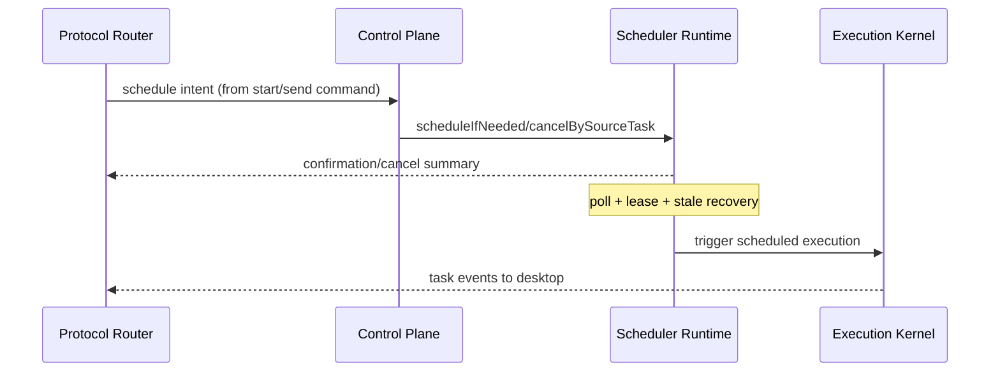

# CoworkAny 运行时收敛方案（框架定版 + 流程定版）

> 日期：2026-04-08  
> 目标：先在方案层面确定统一框架与流程，再进入代码梳理与收敛实施。

## 1. 背景与问题定义

当前 `coworkany` 在 Sidecar 层同时承载了大量来自 claude-code 与 Mastra 的迁移代码。虽然入口已经收敛到 `main.ts -> main-mastra.ts` 单路径，但“框架切换”尚未完成“运行时职责收敛”，导致：

- 模块边界混杂，路径单一但逻辑仍是多来源叠加。
- 协议入口过重，任务/恢复/远程会话/审批/能力管理强耦合。
- 调度、能力、治理链路存在并存实现和语义重叠。
- 文档与代码实况明显漂移，团队对当前架构认知不一致。

本方案优先回答三件事：

1. **As-Is 真实架构是什么**（基于代码证据）  
2. **To-Be 应该是什么框架**（控制面/执行面/治理面）  
3. **如何分阶段收敛**（可验证、可回滚、可落地）

## 2. As-Is 基线（2026-04-08）

### 2.1 入口与主链路（已确认）

- 运行入口：`sidecar/src/main.ts` 强制导入 `main-mastra.ts`。
- Sidecar 主处理：`sidecar/src/main-mastra.ts` 组装 `entrypoint + streaming + scheduler + additionalCommands + policy/mcp/remote-session`。
- 主协议路由：`sidecar/src/mastra/entrypoint.ts`，并拆分到：
  - `entrypointTaskCommands.ts`
  - `entrypointRecoveryCommands.ts`
  - `entrypointRemoteSessionCommands.ts`
- 工作流执行：`sidecar/src/mastra/taskExecutionService.ts` 默认走 `control-plane` workflow。
- 工作流步骤仍调用 legacy orchestration：
  - `workflows/steps/analyze-intent.ts` -> `orchestration/workRequestAnalyzer.ts`
  - `workflows/steps/assess-risk.ts` -> `orchestration/workRequestPolicy.ts`
  - `workflows/steps/research-loop.ts` -> `orchestration/researchLoop.ts`
  - `workflows/steps/freeze-contract.ts` -> `orchestration/workRequestAnalyzer.ts`

### 2.2 代码体量热点（已实测）

- `sidecar/src`：96 个 TS/TSX 文件，约 **24,574 LOC**
- `sidecar/src/mastra`：约 **15,293 LOC**
- `desktop/src-tauri/src`：约 **12,614 LOC**
- 体量热点文件：
  - `mastra/entrypoint.ts` 4165
  - `ipc/streaming.ts` 1901
  - `handlers/capabilities.ts` 1316
  - `mastra/entrypointRemoteSessionCommands.ts` 1129
  - `mastra/entrypointRecoveryCommands.ts` 851
  - `mastra/additionalCommands.ts` 833
  - `mastra/entrypointTaskCommands.ts` 812
  - `scheduling/scheduledTasks.ts` 655
  - `orchestration/workRequestAnalyzer.ts` 644
  - `mastra/schedulerRuntime.ts` 553

### 2.3 运行风险信号（代码证据）

- `desktop/src-tauri/src/ipc.rs` 对 `send_task_message` 在 30s ACK 超时场景“按已排队成功”处理（容错补偿而非根因解决）。
- `desktop/src-tauri/src/sidecar.rs` 存在大量任务/聊天超时与重试环境参数，说明运行链路复杂且稳定性依赖参数调优。
- `sidecar/src/mastra/workflows/scheduled-task.ts`（轻量 stub）与 `sidecar/src/mastra/schedulerRuntime.ts`（真实执行）并存。
- `handlers/capabilities.ts` 与 `mastra/additionalCommands.ts` 均承担能力治理职责，存在横切耦合。

### 2.4 文档漂移

- `docs/plans/2026-03-30-mastra-single-path-function-matrix.md` 声称 `sidecar/src` 约 8.9K LOC / 54 文件，已与当前实况明显不符。
- `docs/agent-system.md` 仍大量描述 ReAct/openclaw 等历史体系，不对应当前 Mastra 主执行链路。

## 3. 根因归纳

1. **迁移策略是“叠加”而非“替换”**  
   Mastra workflow 作为壳层接入，但核心意图/策略/研究逻辑仍在 legacy orchestration。

2. **协议入口过载**  
   `entrypoint.ts + Task/Recovery/RemoteSession` 分支过多，导致状态机分散，跨命令一致性难保证。

3. **同类职责多处实现**  
   调度、能力治理、命令扩展、恢复逻辑都有并存路径，增加认知与回归成本。

4. **缺少“框架级单一事实源”**  
   代码已经变更，文档未同步收敛，导致后续重构目标不稳定。

## 4. To-Be 框架（方案定版）

### 4.1 总体分层

```text
Desktop(Tauri IPC)
  -> Sidecar Protocol Router（薄层协议适配）
    -> Control Plane（意图/风险/计划/状态机）
      -> Execution Kernel（执行队列 + workflow/direct 统一驱动）
        -> Capability & Policy Gate（权限、审批、治理、审计）
          -> Tool/MCP/Skill Adapters（外设与扩展）
```

### 4.2 三大平面

1. **控制平面（Control Plane）**
   - 负责意图解析、风险判定、任务状态机、恢复策略编排。
   - 不直接做工具副作用调用。

2. **执行平面（Execution Plane）**
   - 负责任务排队、workflow run、超时重试、上下文压缩、流式事件回传。
   - `start_task` 与 `send_task_message` 走同一执行内核。

3. **治理平面（Governance Plane）**
   - 统一 skill/toolpack/mcp/policy/approval 的判定与审计。
   - 所有高风险副作用必须经过同一 policy gate。

### 4.3 模块边界约束（必须满足）

- `Protocol Router` 只做：解析、校验、路由、ACK；不持有复杂业务分支。
- `Control Plane` 只做：决策与状态转换；不直接触达外部工具执行。
- `Execution Kernel` 只做：执行调度、重试、超时、流式桥接；不做策略决策。
- `Governance Plane` 只做：权限/审批/依赖治理；不拼装 UI 语义回复。

## 5. 统一流程（方案流程定版）

### 5.1 流程 A：`start_task` / `send_task_message`



### 5.2 流程 B：调度任务（创建/取消/触发）



### 5.3 流程 C：恢复与断点续跑（`recover_tasks` / `resume_interrupted_task`）

1. Router 只接收恢复命令并做参数校验。  
2. Control Plane 扫描任务状态仓，判定 `resume/retry/skip`。  
3. Execution Kernel 统一执行恢复动作，输出标准事件。  
4. 恢复过程中的审批映射、远程会话映射由 Governance Plane 提供一致性校验。

### 5.4 流程 D：审批与策略网关

- 所有 effect 类操作统一进入 policy gate。
- 审批请求统一建索引（`requestId -> taskId/runId/toolCallId`）。
- 任务终态（complete/error/cancelled）必须触发审批挂起清理。
- 远程会话注入事件与本地审批路径共用审计日志模型。

## 6. “保留 / 迁移 / 删除”框架清单

### 6.1 保留（继续作为核心）

- Mastra workflow runtime（`control-plane` 主链路）
- Task runtime state / transcript / policy decision log / hook runtime
- Scheduler lease + stale recovery 机制
- capability/marketplace/mcp 安全治理能力（但收敛到统一治理面）

### 6.2 迁移（从混合状态迁到统一边界）

1. `orchestration/workRequest*`  
   从“被 workflow step 直接调用”迁移为 `control-plane/domain/*` 纯领域模块。

2. `entrypoint*.ts`  
   从“巨型协议处理”迁移为：
   - protocol router
   - task command handler
   - recovery handler
   - remote session handler
   - shared state-machine service

3. `additionalCommands + capabilities`  
   迁移为统一 `governance service`，减少双入口分叉。

4. `scheduled-task workflow` 与 `schedulerRuntime`  
   明确唯一真执行路径，另一路降级为编排壳或删除。

### 6.3 删除（确认无运行时价值后）

- 与当前主链路无入边的历史兼容层和过期文档描述。
- 重复语义模块（同一职责多实现）在迁移完成后逐步移除。

## 7. 分阶段实施路线（先方案，后梳理）

### Phase 0：框架冻结与基线锁定（当前文档阶段）

- 输出：
  - 本文档（To-Be 架构 + 流程 + 模块收敛清单）
  - 当前体量基线（LOC/热点文件/流程图）
- 验收：
  - 团队确认“单一框架定义”与边界约束。

### Phase 1：协议入口瘦身 + 状态机统一

- 目标：
  - 将 Router 与 Control Plane 职责剥离。
  - 固化统一任务状态机（含 queued/running/waiting/terminal）。
- 关键动作：
  - 抽离共享状态机服务；
  - `start_task/send_task_message/resume/cancel` 共用状态转换。
- 验收：
  - ACK/queue/terminal 事件时序一致；
  - `send_task_message` 超时按 queued 成功的补偿逻辑显著收敛。

### Phase 2：调度与恢复收敛

- 目标：
  - 调度只保留一套“真实执行链路”；
  - 恢复逻辑统一由状态机驱动。
- 关键动作：
  - 明确 `schedulerRuntime` 与 workflow 关系（单真源）；
  - `recover_tasks` 与 resume/retry 策略收敛到同一模块。
- 验收：
  - 重启恢复、stale recovery、链式调度通过端到端回归。

### Phase 3：治理平面统一

- 目标：
  - skill/toolpack/mcp/policy/approval 统一决策与审计。
- 关键动作：
  - 合并 additionalCommands/capabilities 的重叠职责；
  - 统一治理 API 与审计字段。
- 验收：
  - 治理命令与执行命令分层清晰；
  - 审批/策略日志可追溯且字段一致。

### Phase 4：减负清理 + 文档收敛

- 目标：
  - 删除迁移后冗余模块；
  - 更新过期文档，建立单一事实源。
- 关键动作：
  - 删除确认无入边模块；
  - 重写 `docs/agent-system.md` 为当前架构；
  - 将本方案升级为“实施状态文档”。
- 验收：
  - 体量与复杂度指标明显下降；
  - 文档与代码一致。

## 8. 验收指标（框架层）

### 8.1 架构指标

- `Protocol Router` 仅保留协议适配，不再承载高复杂业务判断。
- 同一职责仅一条运行路径（调度、恢复、治理）。
- 关键状态机具备统一定义与单点实现。

### 8.2 稳定性指标

- `start_task/send_task_message` ACK 超时率下降。
- 恢复链路成功率提升（重启后恢复、审批后恢复）。
- 调度重复触发、僵尸运行（stale running）事件下降。

### 8.3 维护性指标

- Sidecar 热点大文件（entrypoint/capabilities/additionalCommands）拆分后复杂度下降。
- 文档基线与代码结构一致，避免“看文档误判已完成”。

## 9. 风险与回滚

1. 风险：状态机收敛阶段可能引入协议时序回归。  
   对策：保留命令级契约测试 + e2e 时序回归。

2. 风险：治理平面合并引发权限边界变化。  
   对策：先做接口兼容层，逐步切流，保留决策审计比对。

3. 风险：调度链路统一时影响历史任务兼容。  
   对策：提供迁移读写兼容与灰度开关，保留可回滚路径。

## 10. 后续执行约束

- 先按本方案拆分实施，再做大规模删除。
- 每个阶段必须有“行为不变证据”（测试与事件序列比对）。
- 文档更新与代码变更同批推进，防止再次漂移。

---

## 附录 A：本方案对应的关键代码锚点

- Sidecar 入口与装配：
  - `sidecar/src/main.ts`
  - `sidecar/src/main-mastra.ts`
- 协议与任务处理：
  - `sidecar/src/mastra/entrypoint.ts`
  - `sidecar/src/mastra/entrypointTaskCommands.ts`
  - `sidecar/src/mastra/entrypointRecoveryCommands.ts`
  - `sidecar/src/mastra/entrypointRemoteSessionCommands.ts`
  - `sidecar/src/mastra/taskExecutionService.ts`
- 工作流与 legacy 连接：
  - `sidecar/src/mastra/workflows/control-plane.ts`
  - `sidecar/src/mastra/workflows/steps/*.ts`
  - `sidecar/src/orchestration/workRequestAnalyzer.ts`
- 调度：
  - `sidecar/src/mastra/schedulerRuntime.ts`
  - `sidecar/src/mastra/workflows/scheduled-task.ts`
  - `sidecar/src/scheduling/scheduledTasks.ts`
- 治理：
  - `sidecar/src/handlers/capabilities.ts`
  - `sidecar/src/mastra/additionalCommands.ts`
  - `sidecar/src/mastra/mcp/*.ts`
- Desktop IPC：
  - `desktop/src-tauri/src/ipc.rs`
  - `desktop/src-tauri/src/sidecar.rs`
