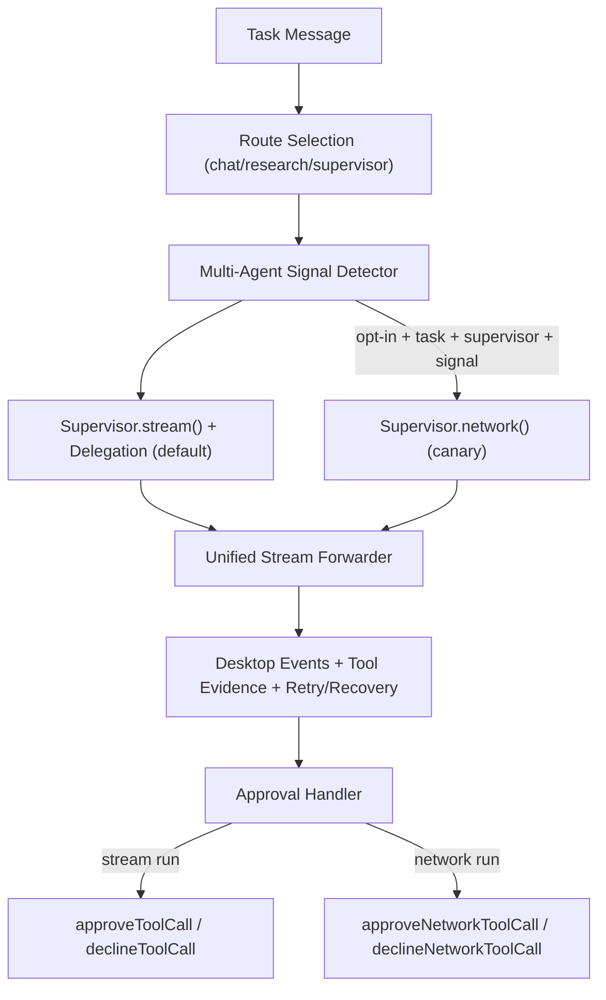

# CoworkAny Multi-Agent 实施方案（参考 Claude Code + Mastra）

日期：2026-04-14  
范围：`sidecar` 运行时（Mastra 路径）  
目标：在不做“特定意图补丁”的前提下，落地通用 multi-agent 编排能力，并可持续迁移 `claude-code` 的成熟模式（优先可直接移植代码）。

---

## 0. 当前执行状态（已落地）

- Mastra 依赖已升级到稳定最新版（2026-04-14）：
  - `@mastra/core`: `1.24.1`（原 `^1.17.0`）
  - `@mastra/mcp`: `1.4.2`（原 `^1.3.1`）
  - `@mastra/memory`: `1.15.0`（原 `^1.10.0`）
  - `@mastra/libsql`: `1.8.0`（原 `^1.7.2`）
  - `@mastra/loggers`: `1.1.1`（原 `^1.0.3`）
- CoworkAny 继续保持 Mastra 单主路径运行（`main.ts -> main-mastra.ts`），无 legacy runtime 分支回退。
- 新增 claude-code 补充迁移：
  - `sidecar/src/mastra/agentTaskNotification.ts`
  - `sidecar/src/mastra/agentTaskStore.ts`
  - `sidecar/src/mastra/subagentSchemas.ts`
  - `sidecar/src/mastra/subagentMessageRouter.ts`
  - 在 `ipc/bridge.ts` 中把 `agent-*` 生命周期事件归一为可追踪任务通知（通过既有 `tool_call/tool_result` 事件通道）。
  - 在 `mastra/entrypoint.ts` 与 `taskRuntimeState.ts` 中新增子代理生命周期持久化字段 `agentTasks`：
    - `tool_call/tool_result(agent_task_notification)` 会实时写入 `TaskRuntimeState.agentTasks`
    - `get_task_runtime_state` 与 `get_runtime_snapshot` 现在返回子代理生命周期快照
    - `MastraTaskRuntimeStateStore` 与重启恢复链路可保留该状态
  - 新增可寻址子代理 follow-up 命令：`send_subagent_message`
    - 可按 `subagentTaskId` 定向续跑特定子代理线程
    - 自动注入子代理 follow-up 执行契约并强制 `task` 路由
    - 无效 payload / task 缺失 / 子代理 ID 缺失都会返回结构化错误（含候选 `availableSubagentTaskIds`）

---

## 1. 目标与约束

### 1.1 目标
- 把 CoworkAny 从“单 agent 主路径 + 零散 delegation”升级为“可策略化启用的多 agent 编排路径”。
- 对齐 Mastra 官方建议：默认走 supervisor + `stream/generate` 的多代理编排；仅在灰度需要时启用 `agent.network()`。
- 复用 Claude Code 已验证的多代理协作原则（任务分解、角色边界、结果整合、禁止伪造子代理结果）。
- 保持回滚安全：默认保留 `stream()` 主路径，multi-agent 仅在明确信号下注入执行契约；`network()` 作为可控灰度选项。

### 1.2 非目标
- 不引入硬编码“某题某场景专用脚本”。
- 不把 `claw-bench` verifier 逻辑塞进生产运行时。
- 不一次性重写所有 IPC 协议与 UI。

---

## 2. 对齐来源与可移植清单

## 2.1 Claude Code 可移植模式

来源文件（本地参考）：
- `claude-code/src/tools/AgentTool/prompt.ts`
- `claude-code/src/tools/AgentTool/AgentTool.tsx`
- `claude-code/src/tools/AgentTool/agentToolUtils.ts`
- `claude-code/src/tasks/LocalAgentTask/LocalAgentTask.tsx`

可移植要点：
- 明确 “什么时候要 delegate，什么时候不要 delegate” 的策略层。
- 子代理结果不可臆造，必须等待真实完成信号。
- 角色边界与并行拆分优先于单轮大 Prompt。
- 任务可观测：run/task 维度状态与进度追踪。

## 2.2 Mastra 官方最佳实践（对齐方向）

来源（官方文档/变更）：
- `agent.network()` / `resumeNetwork()` / `approveNetworkToolCall()` / `declineNetworkToolCall()`
- `workflows` 的 `suspend/resume`、`snapshot/time-travel`、`retry` 机制
- `resource/thread` 作用域隔离建议
- 官方迁移建议：从 network 迁移到 supervisor 模式（supervisor + `stream/generate`）
- 参考链接：
  - https://mastra.ai/docs/agents/networks
  - https://mastra.ai/guides/migrations/network-to-supervisor
  - https://mastra.ai/blog/changelog-2026-02-26

可移植要点：
- 多 agent 执行默认用 supervisor 模式（`stream/generate` + delegation）；Network 仅在兼容/灰度场景启用。
- 统一 runId + requestContext + memory(thread/resource) 做恢复和审计。
- 保留 `stream` 路径作为回退，避免一次性切换风险。

---

## 3. 目标架构（落地版本）

---

## 4. 已实施变更（本次）

## 4.1 新增 multi-agent 策略模块

文件：`sidecar/src/mastra/multiAgentExecution.ts`

能力：
- `detectMultiAgentIntent()`：基于显式关键词、角色提示、分阶段流程信号做通用判定。
- `shouldEnableAgentNetworkExecution()`：仅在 `task + supervisor + multi-agent signal + 显式 network 偏好开关` 时启用 Network。
- `injectMultiAgentExecutionContract()`：注入统一执行契约（角色分工、日志留痕、先完成再整合）。

这部分直接移植了 Claude Code 在 Agent Prompt 中的协作原则（不是按题目硬编码）。

## 4.2 Streaming 主循环接入双执行路径

文件：`sidecar/src/ipc/streaming.ts`

变更：
- 在路由后增加 multi-agent 信号判定与合同注入（默认 stream 也注入）。
- 新增 `RuntimeStreamLike` 统一抽象，兼容：
  - `agent.stream()`（`fullStream`）
  - `agent.network()`（`ReadableStream` async iterator）
- 新增 `resolveChunkIterator()`，使 forwarder 可消费两种流形态。
- 缓存 run context 时记录 `executionMode: stream|network`。

## 4.3 审批恢复支持 network run

文件：`sidecar/src/ipc/streaming.ts`

变更：
- `handleApprovalResponse()` 根据 run context 的 `executionMode` 自动切换：
  - `approveToolCall / declineToolCall`
  - `approveNetworkToolCall / declineNetworkToolCall`
- 保留原有 fallback runId 恢复逻辑。

## 4.4 Supervisor 指令增强（通用，不针对单题）

文件：`sidecar/src/mastra/agents/supervisor.ts`

新增规则：
- 明确 multi-agent 请求必须先拆角色再委派。
- 禁止在子代理完成前伪造结果。
- 文件输出任务要求保留角色级可审计工件。

## 4.5 回归测试

文件：`sidecar/tests/multi-agent-execution.test.ts`

覆盖：
- multi-agent 意图检测（正/负例）
- 合同注入幂等
- network 启用条件（正例 + 非 supervisor 反例）
- 子代理任务通知桥接（claude-code 风格）
  - `sidecar/tests/agent-task-notification.test.ts`
  - `sidecar/tests/mastra-bridge.test.ts` 新增 `agent-start/agent-finish` 事件映射断言

---

## 5. 可直接移植代码清单（优先）

## 5.1 任务状态机与通知协议（直接移植）
- 来源：
  - `claude-code/src/tasks/LocalAgentTask/LocalAgentTask.tsx`
  - `claude-code/src/coordinator/coordinatorMode.ts`
- 建议在 CoworkAny 新增：
  - `sidecar/src/mastra/agentTaskStore.ts`（register/complete/fail/kill/progress）
  - `sidecar/src/ipc/agentTaskNotification.ts`（统一 task-notification 结构）
- 直接收益：
  - 子代理生命周期可视化
  - 失败/中止可恢复
  - coordinator 与子代理消息解耦

## 5.2 可寻址子代理协议（直接移植）
- 来源：
  - `claude-code/src/entrypoints/sdk/coreSchemas.ts`（AgentInfo/AgentDefinition）
  - `claude-code/src/query.ts`（agentId 作用域消息队列）
- 建议在 CoworkAny 新增：
  - `sidecar/src/mastra/subagentSchemas.ts`
  - `sidecar/src/mastra/subagentMessageRouter.ts`
- 直接收益：
  - 同一 task 内持续向指定子代理 follow-up
  - 避免 main/subagent 消息串扰

## 5.3 并行研究-实现-验证流水线（直接移植）
- 来源：
  - `claude-code/src/coordinator/coordinatorMode.ts` 并行 fan-out/fan-in 约束
- 建议在 CoworkAny 新增：
  - `sidecar/src/mastra/delegationPlanner.ts`
  - `sidecar/src/mastra/delegationSynthesizer.ts`
- 直接收益：
  - 真正并行而不是“单轮大 Prompt 假并行”
  - 写路径冲突最小化（读并行/写分区）

---

## 6. 迁移矩阵（下一阶段，继续“尽量移植”）

## 6.1 P1：子代理任务状态中台（优先）
- 参考：`claude-code/src/tasks/LocalAgentTask/LocalAgentTask.tsx`
- 迁移目标：
  - task registry（agent 子任务生命周期）
  - progress tracker（tool/token/activity）
  - completion/failure/kill 通知统一出口
- CoworkAny 落点建议：
  - `sidecar/src/mastra/agentTaskStore.ts`
  - `sidecar/src/mastra/agentProgressTracker.ts`

## 6.2 P2：可寻址子代理消息路由
- 参考：`AgentTool + SendMessage` 语义
- 迁移目标：
  - 同一 task 内对子代理继续发送 follow-up
  - 保留 thread/resource 与 run lineage
- CoworkAny 落点建议：
  - `entrypointTaskCommands.ts` 扩展 `send_subagent_message`
  - `ipc/bridge.ts` 新增 agent lifecycle 事件

## 6.3 P3：并行角色执行 + 汇总器
- 参考：Claude Code “parallel tool uses in one turn”
- Mastra 对齐：
  - Network routing + role planner
  - completion scorer 做“多角色完成后再收敛”
- 落点建议：
  - `multiAgentExecution.ts` 增加并行策略
  - `supervisor.ts` 增加 role planner/synthesizer 子 agent

---

## 7. 风险与防护

- 风险：network 路径在极端情况下与现有 retry/fallback 交叉导致行为差异。  
  防护：仅在明确 multi-agent 信号启用，默认保持 stream 主路径。

- 风险：误判导致不必要 network 开销。  
  防护：默认 supervisor-stream；network 需显式偏好开关。

- 风险：审批恢复 runId 丢失。  
  防护：沿用既有 fallback runId 扫描，并按 executionMode 选择正确恢复 API。

---

## 8. 配置与开关

- `COWORKANY_MASTRA_ENABLE_AGENT_NETWORK`（默认 `true`）
- `COWORKANY_MASTRA_TASK_ENABLE_MULTI_AGENT_NETWORK`（默认 `true`）
- `COWORKANY_MASTRA_PREFER_AGENT_NETWORK`（默认 `false`，建议仅灰度/回归时开启）

建议灰度：
1. 先在 bench/CI 环境开启。  
2. 观测 network run 比例、失败率、审批恢复成功率。  
3. 再逐步放量到默认生产配置。

---

## 9. 验收标准

- 功能：multi-agent 明确信号任务默认走 supervisor-stream 的多代理编排；普通任务不受影响。
- 功能：开启 `COWORKANY_MASTRA_PREFER_AGENT_NETWORK=1` 后，才切换到 network 路径。
- 稳定：审批恢复在 stream/network 两种 run 上均可闭环。
- 通用性：不依赖单一 benchmark 任务 ID 或固定文件名。
- 可测试：策略层单测覆盖 + 现有主链路回归通过。
